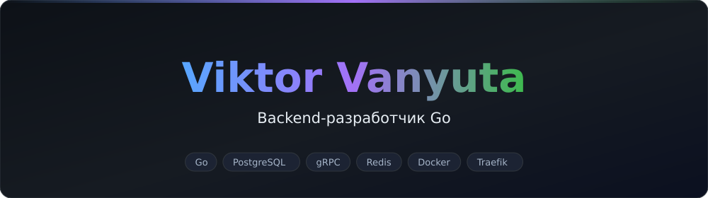
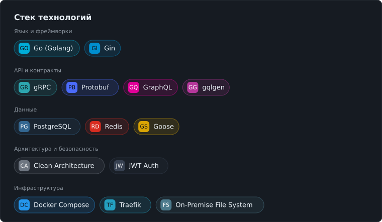
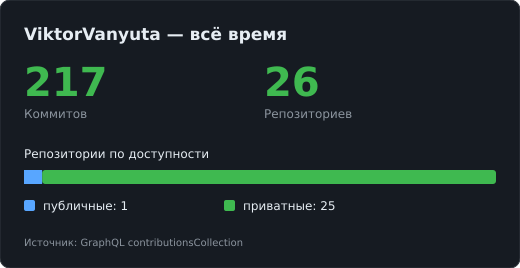
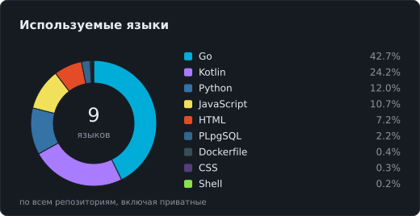

  

  Бэкенд-разработчик с бэкграундом в мобильной разработке. 
  Clean Architecture · микросервисы · PostgreSQL · gRPC · Docker Compose

---

  

## 🧱 Что делаю

<table>
  <tr>
    <td width="50%" valign="top">
      <b>🏗 Архитектура</b> 
      Clean Architecture, микросервисы с отдельной БД на сервис, Backend for Frontend (BFF), REST API, gRPC / Protobuf.
    </td>
    <td width="50%" valign="top">
      <b>🗄 Базы данных & хранение</b> 
      Изолированные PostgreSQL на каждый микросервис, схемы и миграции через Goose, кэширование в Redis.
    </td>
  </tr>
  <tr>
    <td width="50%" valign="top">
      <b>🌐 Сетевой контур</b> 
      Traefik в Docker Compose разводит HTTP-трафик (:80) и межсервисный gRPC (500XX).
    </td>
    <td width="50%" valign="top">
      <b>📂 Работа с файлами</b> 
      Сквозное управление документацией, безопасное версионирование (<code>major</code>/<code>minor</code>, <code>current</code>/<code>history</code>), <code>soft</code>/<code>hard delete</code>, потоковые <code>io.Reader</code>/<code>io.Writer</code>.
    </td>
  </tr>
  <tr>
    <td colspan="2" valign="top">
      <b>🔐 Безопасность и контур</b> 
      On-Premise решения для серверов компании в закрытых доменных сетях — без доступа во внешнюю сеть. Кастомные ролевые JWT-мидлвари: <code>Secret</code> + <code>Salt</code>, <code>RequireAdmin</code>.
    </td>
  </tr>
</table>

---

## 📊 Активность на GitHub

<table>
  <tr>
    <td width="50%"></td>
    <td width="50%"></td>
  </tr>
</table>

  Считается <b>за всё время</b> и <b>по всем репозиториям, включая приватные</b> — исходный код приватных коммерческих репозиториев скрыт по требованиям безопасности.

---

## 📫 Контакты

  
  

